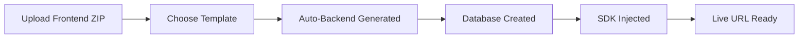

# 📄 **README.md** - Copy and paste this!

```markdown
# 🚀 AutoBackend - Deploy Frontend, Get Full-Stack App Instantly

[](https://railway.app/template/your-template)


> **Upload your frontend → Get a live full-stack app with database & API in seconds. No backend code needed.**

---

## ✨ **Demo**


**Live Demo:** [https://autobackend.up.railway.app](https://autobackend.up.railway.app)

---

## 🎯 **What It Does**

AutoBackend is a **platform-as-a-service** that automatically generates backend infrastructure from your frontend code:

### **For Developers:**


### **Features:**
✅ **Instant Backend** - REST API auto-generated  
✅ **Database per App** - Isolated JSON database  
✅ **Authentication** - Built-in user system  
✅ **Dashboard** - Manage all your apps  
✅ **SDK** - `window.AutoBackend` for easy API calls  
✅ **Multi-tenant** - Each user gets private apps  
✅ **Admin Panel** - Monitor all deployments  

---

## 🏗️ **Architecture**

```
┌─────────────────────────────────────┐
│         AutoBackend Platform         │
├─────────────────────────────────────┤
│  ┌───────────────────────────────┐  │
│  │    Node.js + Express          │  │
│  │    • Authentication (JWT)     │  │
│  │    • File Upload               │  │
│  │    • Auto API Generation       │  │
│  │    • SDK Injection             │  │
│  └───────────────────────────────┘  │
│              │                       │
│  ┌───────────▼───────────┐           │
│  │    Persistent Volume    │           │
│  │  ┌─────────────────┐  │           │
│  │  │ /uploads/       │  │           │
│  │  ├─────────────────┤  │           │
│  │  │ /deploy/        │  │           │
│  │  │   ├─ app_123/   │  │           │
│  │  │   │  ├ frontend │  │           │
│  │  │   │  └ db.json  │  │           │
│  │  │   └─ app_456/   │  │           │
│  │  ├─────────────────┤  │           │
│  │  │ apps.json       │  │           │
│  │  └─────────────────┘  │           │
│  └───────────────────────┘           │
└─────────────────────────────────────┘
```

---

## 🚀 **Quick Start**

### **1. Clone & Install**
```bash
git clone https://github.com/yourusername/autobackend.git
cd autobackend
npm install
```

### **2. Environment Setup**
Create `.env` file:
```env
JWT_SECRET=your-super-secret-key-change-this
PORT=3000
NODE_ENV=development
```

### **3. Run Locally**
```bash
npm start
```
Visit: `http://localhost:3000`

### **4. Deploy to Railway**
[](https://railway.app/new)

1. Click the button above
2. Connect your GitHub repo
3. Add volume: `/app/data`
4. Add env var: `JWT_SECRET=your-secret`
5. Deploy! 🚀

---

## 📚 **API Documentation**

### **User Authentication**
```javascript
// Register
POST /api/auth/register
{
  "email": "user@example.com",
  "password": "secret123",
  "name": "John Doe"
}

// Login
POST /api/auth/login
{
  "email": "user@example.com",
  "password": "secret123"
}
```

### **App Deployment**
```javascript
// Upload frontend ZIP
POST /api/upload
// FormData with file

// Deploy app
POST /api/deploy
{
  "uploadId": "abc123",
  "templateId": "blog",
  "name": "My Blog"
}
```

### **Auto-Generated API (per app)**
Once deployed, each app gets:

```javascript
// Base URL: /api/{appId}

// List all posts
GET /posts

// Get single post
GET /posts/:id

// Create post
POST /posts
{
  "title": "Hello World",
  "content": "My first post"
}
```

---

## 🎨 **Templates**

| Template | Collections | Use Case |
|----------|------------|----------|
| **Blog** | `posts`, `comments`, `users` | Personal blog, CMS |
| **E-commerce** | `products`, `carts`, `orders` | Online store |
| **CRUD** | `items`, `settings` | Admin dashboard |

---

## 💻 **Client SDK**

Auto-injected into every app:

```javascript
// Available globally
window.AutoBackend

// Database operations
await AutoBackend.db.list('posts')
await AutoBackend.db.get('posts', '123')
await AutoBackend.db.create('posts', { title: 'New Post' })
await AutoBackend.db.update('posts', '123', { title: 'Updated' })
await AutoBackend.db.delete('posts', '123')

// Raw API call
await AutoBackend.api('/custom-endpoint')
```

---

## 🖥️ **Screenshots**

### Dashboard
```
┌─────────────────────────────────────┐
│  📱 My Applications                 │
│  ┌─────────────────────────────┐   │
│  │ Total: 3  Running: 2        │   │
│  └─────────────────────────────┘   │
│                                     │
│  ┌─────────────────────────────┐   │
│  │ My Blog - live              │   │
│  │ Posts: 5  Size: 12KB        │   │
│  │ [Open] [Database] [Delete]  │   │
│  └─────────────────────────────┘   │
│                                     │
│  ┌─────────────────────────────┐   │
│  │ Shop - live                 │   │
│  │ Products: 3  Size: 8KB      │   │
│  │ [Open] [Database] [Delete]  │   │
│  └─────────────────────────────┘   │
└─────────────────────────────────────┘
```

### Database Viewer
```
┌─────────────────────────────────────┐
│  Database: app_123                  │
│  ┌─────────────────────────────┐   │
│  │ posts (5 records)           │   │
│  │ id │ title      │ created   │   │
│  │────│────────────│───────────│   │
│  │ 1  │ Hello      │ 2024-...  │   │
│  │ 2  │ World      │ 2024-...  │   │
│  └─────────────────────────────┘   │
└─────────────────────────────────────┘
```

---

## 🛠️ **Tech Stack**

| Layer | Technology |
|-------|------------|
| **Backend** | Node.js, Express |
| **Auth** | JWT, bcrypt |
| **File Upload** | Multer, Adm-Zip |
| **Database** | JSON files (per app) |
| **Frontend** | HTML, CSS, Vanilla JS |
| **Deployment** | Railway.app |
| **Storage** | Railway Volumes |

---

## 📁 **Project Structure**

```
autobackend/
├── server/
│   ├── index.js          # Main server
│   └── auth.js           # Authentication
├── public/
│   ├── index.html        # Landing page
│   ├── dashboard.html    # User dashboard
│   └── admin.html        # Admin panel
├── package.json
├── railway.json          # Railway config
├── Procfile              # Process config
└── .gitignore
```

---

## 🚦 **Roadmap**

- [x] User authentication
- [x] File upload & deployment
- [x] Auto-backend generation
- [x] Database per app
- [x] SDK injection
- [x] User dashboard
- [x] Admin panel
- [x] Production deployment
- [ ] Custom domains
- [ ] Team collaboration
- [ ] Usage quotas
- [ ] Stripe integration
- [ ] File storage (images)

---

## 🤝 **Contributing**

1. Fork the project
2. Create feature branch (`git checkout -b feature/AmazingFeature`)
3. Commit changes (`git commit -m 'Add AmazingFeature'`)
4. Push to branch (`git push origin feature/AmazingFeature`)
5. Open a Pull Request

---

## 📝 **License**

MIT © [Your Name]

---

## ⭐ **Support**

Give a ⭐ if this project helped you!

---

## 📧 **Contact**

- GitHub: [@yourusername](https://github.com/yourusername)
- Twitter: [@yourtwitter](https://twitter.com/yourtwitter)
- Email: your.email@example.com

---

## 🙏 **Acknowledgments**

- [Railway](https://railway.app) for amazing hosting
- [Express](https://expressjs.com) for the framework
- [JWT](https://jwt.io) for authentication
- All contributors and users

---

**Built with ❤️ for developers who hate writing backend code**
```

---

## 📋 **Quick Copy Commands**

```bash
# Create README.md
cat > README.md << 'EOF'
[PASTE THE ENTIRE CONTENT ABOVE HERE]
EOF
```

## 🎯 **What to Customize:**

1. Replace `yourusername` with your GitHub username
2. Add your actual demo link
3. Add screenshots (replace placeholder URLs)
4. Add your contact info
5. Update the license if needed

---

## 🚀 **After Adding README:**

```bash
git add README.md
git commit -m "Add README"
git push
```

Your GitHub repo now looks **professional and ready for hiring managers!** 🔥