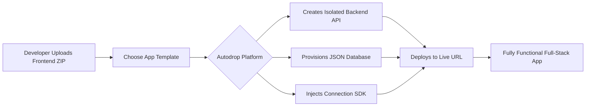

# 🚀 Autodrop - From Frontend to Full-Stack, Instantly

[](https://web-production-8db36.up.railway.app)

> **Autodrop is an intelligent full-stack automation tool. Upload your frontend code, and it instantly generates a production-ready backend, API, and database. No backend coding required.**

---

## ✨ **Live Demo**

<h3 align="center">
  👉 <a href="https://web-production-8db36.up.railway.app"><strong>🚀 CLICK HERE TO TRY THE LIVE PLATFORM »</strong></a> 👈
</h3>

<p align="center">
  <a href="https://web-production-8db36.up.railway.app">
    
  </a>
</p>

**Live URL:** [https://web-production-8db36.up.railway.app](https://web-production-8db36.up.railway.app)


---

## 🎯 **What It Does**

Autodrop is a **Platform-as-a-Service (PaaS)** built for frontend developers. It eliminates backend complexity by automatically provisioning infrastructure based on your project.



### **Core Features**

✅ **Instant Backend API** - RESTful endpoints are auto-generated based on your template choice.
✅ **Per-App Database** - Each deployment gets its own isolated, persistent JSON database.
✅ **Built-in Auth** - Complete user registration, login, and JWT session management.
✅ **User Dashboard** - A central hub to manage, monitor, and delete your deployed apps.
✅ **Magic SDK** - A simple `window.AutoBackend` object is auto-injected into your frontend for easy API calls.
✅ **Multi-Tenant Architecture** - User data and apps are completely isolated and private.
✅ **Admin Superpowers** - A dedicated admin panel to view and manage all deployments on the platform.

---

## 🏗️ **Architecture**

The platform uses a single Node.js server to handle everything, making it efficient and easy to deploy.

```
┌─────────────────────────────────────────────────┐
│                  User's Browser                  │
│         (interacts with their deployed app)       │
└───────────────────────┬─────────────────────────┘
                        │ API Calls (/api/app_123)
                        ▼
┌─────────────────────────────────────────────────┐
│              Autodrop Platform Server            │
│  (Node.js + Express - Single Process)            │
├─────────────────────────────────────────────────┤
│ • Authentication (JWT)     • File Upload (ZIP)   │
│ • Template Engine          • Universal API CRUD  │
│ • SDK Injection            • Deployment Orchestr.│
└───────────────┬─────────────────┬───────────────┘
                │                 │
    ┌───────────▼───────────┐ ┌───▼─────────────────┐
    │  Persistent Volume     │ │  Static File Serving│
    │  (e.g., Railway Disk)  │ │  (/apps/app_123)    │
    ├───────────────────────┤ ├─────────────────────┤
    │ 📁 /uploads/           │ │ Serves user's       │
    │ 📁 /deploy/            │ │ HTML/CSS/JS files   │
    │ │  ├─ app_123/        │ │ from /deploy/app_123│
    │ │  │  ├─ frontend/    │ │ /frontend/           │
    │ │  │  └─ db.json      │ │                     │
    │ │  └─ app_456/        │ │                     │
    │ └─ apps.json (metadata)│ │                     │
    └───────────────────────┘ └─────────────────────┘
```

---

## 🚀 **Quick Start (Run Locally)**

Get your own instance of Autodrop up and running in minutes.

### **1. Clone & Install**
```bash
git clone https://github.com/kaya95/Autodrop-SaaS-platform.git
cd Autodrop-SaaS-platform
npm install
```

### **2. Environment Setup**
Create a `.env` file in the root directory:
```env
# Generate a strong secret: run `node -e "console.log(require('crypto').randomBytes(32).toString('hex'))"`
JWT_SECRET=your-strong-secret-key-here
PORT=3000
NODE_ENV=development
```

### **3. Run Locally**
```bash
npm start
```
Your platform will be live at **`http://localhost:3000`**

---

## ☁️ **Deploy to Railway (Production)**

This platform is designed to be deployed effortlessly on Railway.

[](https://railway.app/new)

1.  Click the **"Deploy on Railway"** button above.
2.  Connect your GitHub repository (`kaya95/Autodrop-SaaS-platform`).
3.  **Crucial - Add a Volume:** Once deployed, go to the "Volumes" tab in your Railway service and add a volume with the mount path **`/app/data`**. This ensures all user-uploaded files and databases persist.
4.  **Add Environment Variables:** In the "Variables" tab, add:
    *   `JWT_SECRET`: Your strong secret key.
    *   `NODE_ENV`: `production`
5.  Railway will automatically provide a URL like `https://your-project.up.railway.app`.

---

## 📚 **API Documentation**

Once your platform is running, it exposes these core endpoints.

### **User Authentication**
```javascript
// Register a new user
POST /api/auth/register
{ "email": "user@example.com", "password": "secure123", "name": "John Doe" }

// Log in
POST /api/auth/login
{ "email": "user@example.com", "password": "secure123" }
// Response includes a JWT token
```

### **Deploying a New App**
```javascript
// 1. Upload frontend ZIP file
POST /api/upload
// Use 'multipart/form-data' with a field named 'file'

// 2. Trigger deployment
POST /api/deploy
{
  "uploadId": "uuid-from-upload-response",
  "templateId": "blog", // or "ecom", "crud"
  "name": "My Awesome Blog"
}
// Response provides the appId and status URL
```

### **Using Your Deployed App's API**
Every deployed app gets its own set of API endpoints. If your app ID is `app_123`, its base URL is `/api/app_123`.

```javascript
// Get all posts from a blog app
GET /api/app_123/posts

// Create a new post
POST /api/app_123/posts
{
  "title": "My First Post",
  "content": "This is amazing!"
}
```

---

## 🎨 **App Templates**

When deploying, users choose a template that pre-configures the database and API structure.

| Template | Core Collections | Ideal For |
| :------- | :--------------- | :-------- |
| **Blog** | `posts`, `comments`, `users` | Personal blogs, simple CMS |
| **E-commerce** | `products`, `carts`, `orders` | Online stores, product catalogs |
| **CRUD** | `items`, `settings` | Admin dashboards, data management tools |

---

## 💻 **The AutoBackend SDK**

This is the magic that connects a user's frontend to their new backend. It is automatically injected into their `index.html`.

```html
<!-- Injected automatically by Autodrop -->
<script>
// The SDK creates a global object for easy API access
window.AutoBackend = {
  // Core API caller
  api: (endpoint, options) => fetch(`/api/${appId}${endpoint}`, options),

  // Simple database-style helpers
  db: {
    list: (collection) => window.AutoBackend.api(`/${collection}`),
    get: (collection, id) => window.AutoBackend.api(`/${collection}/${id}`),
    create: (collection, data) => window.AutoBackend.api(`/${collection}`, {
      method: 'POST',
      body: JSON.stringify(data)
    })
    // ... and more (update, delete)
  }
};

// Now the frontend can easily interact with its backend!
await AutoBackend.db.create('posts', { title: 'Hello World' });
</script>
```

---

## 🖥️ **Screenshots**

### **Dashboard View**
```
┌─────────────────────────────────────┐
│  📱 My Applications                 │
│  ┌─────────────────────────────┐   │
│  │ Total: 3  Running: 2        │   │
│  └─────────────────────────────┘   │
│                                     │
│  ┌─────────────────────────────┐   │
│  │ My Blog - live              │   │
│  │ Posts: 5  Size: 12KB        │   │
│  │ [Open] [Database] [Delete]  │   │
│  └─────────────────────────────┘   │
│                                     │
│  ┌─────────────────────────────┐   │
│  │ Shop - live                 │   │
│  │ Products: 3  Size: 8KB      │   │
│  │ [Open] [Database] [Delete]  │   │
│  └─────────────────────────────┘   │
└─────────────────────────────────────┘
```

### **Database Viewer**
```
┌─────────────────────────────────────┐
│  Database: app_123                  │
│  ┌─────────────────────────────┐   │
│  │ posts (5 records)           │   │
│  │ id │ title      │ created   │   │
│  │────│────────────│───────────│   │
│  │ 1  │ Hello      │ 2024-...  │   │
│  │ 2  │ World      │ 2024-...  │   │
│  └─────────────────────────────┘   │
└─────────────────────────────────────┘
```

---

## 🛠️ **Tech Stack**

| Layer | Technology |
| :------- | :--------- |
| **Core Backend** | Node.js, Express.js |
| **Authentication** | JWT (JSON Web Tokens), bcrypt |
| **File Handling** | Multer, Adm-Zip |
| **Data Persistence** | JSON file store (per app) |
| **Frontend UI** | Vanilla HTML, CSS, JavaScript |
| **Deployment** | Railway.app |
| **Persistent Storage** | Railway Volumes |

---

## 📁 **Project Structure (Source Code)**

```
Autodrop-SaaS-platform/
├── server/                  # Backend logic
│   ├── index.js             # Main Express server & API routes
│   └── auth.js              # Authentication middleware & helpers
├── public/                  # Frontend for the platform itself
│   ├── index.html           # Landing page & login/signup
│   ├── dashboard.html       # User dashboard for managing apps
│   └── admin.html           # Admin panel for platform oversight
├── package.json
├── railway.json             # Configuration for Railway deployment
├── Procfile                 # Process start command for Railway
├── LICENSE                  # MIT License
└── .gitignore
```

---

## 🚦 **Roadmap**

- [x] Core user authentication system
- [x] File upload and deployment pipeline
- [x] Template-based backend generation
- [x] Per-app database creation
- [x] Auto-injecting SDK
- [x] User dashboard for app management
- [x] Admin monitoring panel
- [x] Production-ready deployment configuration
- [ ] Custom domain support for deployed apps
- [ ] Team/collaboration features
- [ ] Usage quotas and rate limiting
- [ ] Stripe integration for paid plans
- [ ] File/asset storage (e.g., images)

---

## 🤝 **Contributing**

Contributions, issues, and feature requests are welcome!

1.  **Fork** the project.
2.  Create your feature branch (`git checkout -b feature/AmazingFeature`).
3.  Commit your changes (`git commit -m 'Add some AmazingFeature'`).
4.  Push to the branch (`git push origin feature/AmazingFeature`).
5.  Open a **Pull Request**.

---

## 📝 **License**

This project is licensed under the MIT License - see the [LICENSE](LICENSE) file for details.

Copyright (c) 2026 kaya95

---

## 📧 **Contact & Social**

**Kaya** - [click](https://twitter.com/yourtwitter) - RokaiaAli.official@outlook.com

**Project Link:** [https://github.com/kaya95/Autodrop-SaaS-platform](https://github.com/kaya95/Autodrop-SaaS-platform)

**Live Platform:** [https://web-production-8db36.up.railway.app](https://web-production-8db36.up.railway.app)

---

## ⭐ **Show Your Support**

If this project helped you or inspired you, please give it a ⭐ on GitHub! It means a lot.

<p align="center">
  <a href="https://github.com/kaya95/Autodrop-SaaS-platform">
    
  </a>
  <a href="https://twitter.com/intent/tweet?text=Check%20out%20Autodrop%20-%20Upload%20frontend%2C%20get%20full-stack%20app%20instantly!&url=https://github.com/kaya95/Autodrop-SaaS-platform">
    
  </a>
</p>

---

<p align="center">
  <b>👇 TRY IT NOW 👇</b><br>
  <a href="https://web-production-8db36.up.railway.app">
    
  </a>
</p>

---

**Built with ❤️ for developers who hate writing backend code** 🚀


